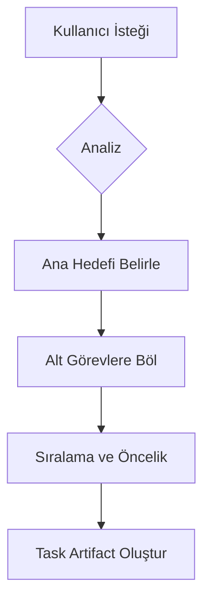

# Plan Workflow

> ⚠️ **GATEKEEPER BAĞLANTISI:** Bu workflow `task.md` dosyası oluşturur. Yazma işlemi öncesinde kullanıcı onayı ZORUNLUDUR. Bkz: `.agent/rules/gatekeeper.md`

> 🧠 **HAFIZA:** Workflow başında `.agent/scripts/core/memory_controller.py set-task`, sonunda `checkpoint` ve `complete-task` çağrılır.

> **Amaç:** Karmaşık işleri küçük parçalara bölmek ve takip edilebilir bir `task.md` oluşturmak.



## Adım 1: Kapsam Analizi
1. İstek tek bir workflow ile çözülebilir mi? (Evet -> Çık ve o workflow'u kullan)
2. Hangi skill'lere ihtiyaç var? (Birden fazla ise not et)
3. Hangi dosyalar etkilenecek?

## Adım 2: Strateji Belirleme
- **Sıralama:** Önce veritabanı mı, yoksa API mi? (Bkz: `docs/architecture.md`)
- **Bağımlılıklar:** A görevi bitmeden B başlayabilir mi?

## Adım 3: Task Artifact Oluşturma
Aşağıdaki formatta bir `task.md` oluştur ve kullanıcıya sun:

```markdown
# [Proje Adı/Görev] Uygulama Planı

- [ ] Hazırlık ve Analiz <!-- id: 0 -->
    - [ ] ...
- [ ] Faz 1: [İsim] <!-- id: 1 -->
    - [ ] ...
- [ ] Faz 2: [İsim] <!-- id: 2 -->
    - [ ] ...
- [ ] Doğrulama ve Test <!-- id: 3 -->
    - [ ] ...
```

## Adım 4: Onay ve Başlangıç
Planı kullanıcıya `notify_user` ile sun. Onay gelirse ilk maddeyi işaretle ve başla.
